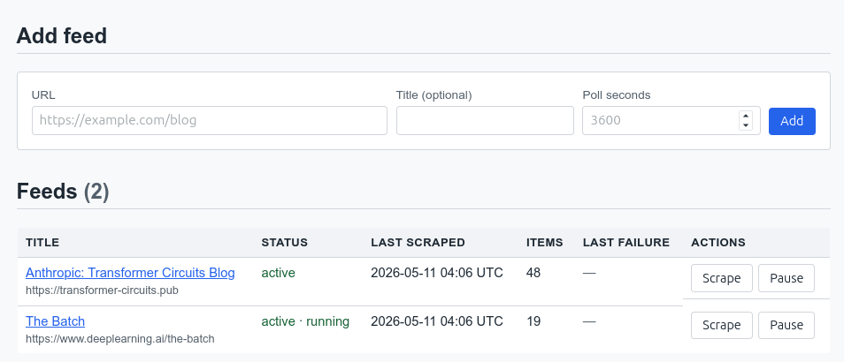
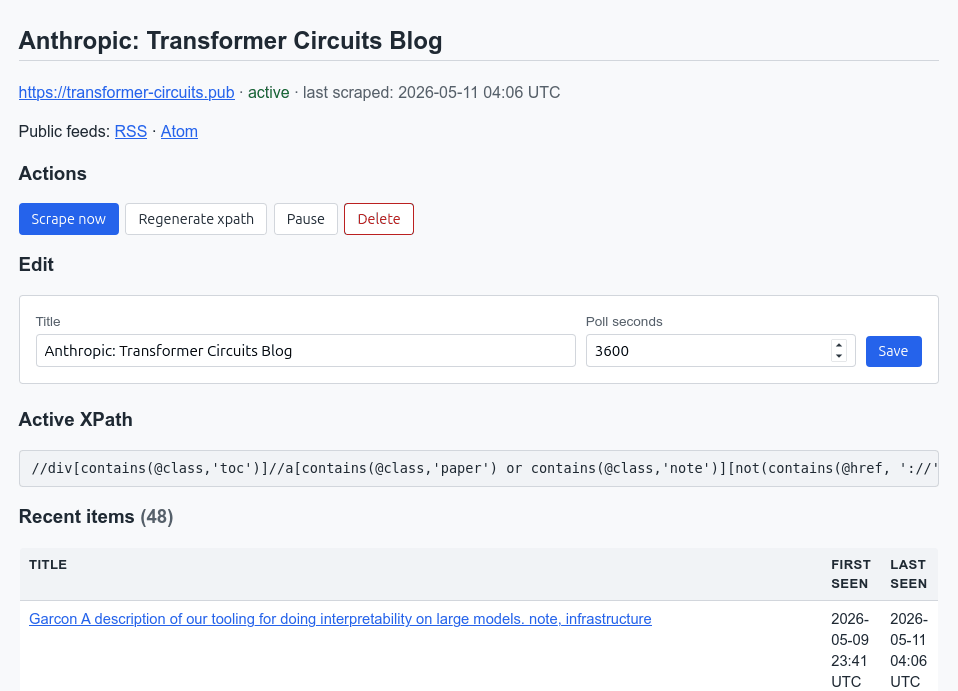

# Veilleur

Veilleur monitors webpages that don't publish a feed and turns them into
RSS/Atom feeds. Point it at a page, and it figures out which links on that
page are articles, polls the page on a schedule, and serves the result as
RSS, Atom, or JSON.





## Features

- **LLM-driven article detection.** Veilleur asks an LLM to derive an
  XPath expression that matches only the article links on the page.
- **XPath reuse — not every scrape calls an LLM.** Once a working
  expression has been derived for a feed, it is cached and reused on
  every subsequent poll. Steady-state scraping costs nothing in LLM
  tokens.
- **Drift detection and automatic regeneration.** Each scrape's links
  are compared against the previous run's longest common prefix
  (ignoring numeric path segments). If the site's layout changes and
  the cached XPath stops matching, Veilleur regenerates it
  automatically and only falls back to "failed" if the new expression
  also can't be validated.
- **Full archival.** Every item ever seen is persisted in Postgres,
  not just the items currently visible on the source page. The
  `/feeds/{id}/items` REST endpoint exposes the full history.
- **RSS, Atom, and JSON outputs** under `/feeds/{id}/{rss,atom,items}`.
- **Web UI** for adding and managing feeds, plus a bearer-token REST
  API for programmatic use.

## Requirements

- Python 3.12+
- Postgres
- An OpenAI-compatible chat completions endpoint (used for XPath
  derivation only)
- A running [passe-partout](https://github.com/jfim/passe-partout)
  instance — Veilleur fetches pages exclusively through it

## Installation

### From source

```sh
git clone https://github.com/jfim/veilleur.git
cd veilleur
just install          # uv sync
just check            # lint + typecheck + tests
alembic upgrade head  # apply DB migrations
just run              # dev server on http://127.0.0.1:8000
```

Configuration is read from environment variables (see
[Configuration](#configuration) below). For local development, a
`.env` file in the project root is loaded automatically.

### Docker

A prebuilt image is published to
`ghcr.io/jfim/veilleur`. To build locally:

```sh
docker build -t veilleur .
```

The container exposes the FastAPI app on port `8000`. Apply migrations
once per fresh DB:

```sh
docker run --rm --env-file .env veilleur alembic upgrade head
```

Then start the server:

```sh
docker run --rm -p 8000:8000 --env-file .env veilleur
```

A `docker-compose.yml` is provided as a starting point that wires
Veilleur, Postgres, and passe-partout together.

## Configuration

All configuration is supplied via environment variables.

### Postgres

| Variable | Default | Description |
| --- | --- | --- |
| `POSTGRES_HOST` | `localhost` | Postgres hostname. |
| `POSTGRES_PORT` | `5432` | Postgres port. |
| `POSTGRES_USER` | `veilleur` | Postgres user. |
| `POSTGRES_PASSWORD` | `veilleur` | Postgres password. |
| `POSTGRES_DB` | `veilleur` | Postgres database name. |

### LLM (xpath derivation)

| Variable | Default | Description |
| --- | --- | --- |
| `LLM_API_URL` | _unset_ | Base URL for the OpenAI-compatible chat completions endpoint. |
| `LLM_MODEL_NAME` | _unset_ | Model identifier passed to the LLM endpoint. |
| `LLM_API_KEY` | _unset_ | Bearer token for the LLM endpoint. |
| `LLM_HTTP_TIMEOUT_SECONDS` | `300` | HTTP timeout for LLM calls (thinking models can take minutes). |

### passe-partout (page fetching)

| Variable | Default | Description |
| --- | --- | --- |
| `PASSEPARTOUT_URL` | _unset_ | Base URL of the passe-partout service. |
| `PASSEPARTOUT_BEARER_TOKEN` | _unset_ | Bearer token for passe-partout. |

### Scraping

| Variable | Default | Description |
| --- | --- | --- |
| `SCRAPE_DEFAULT_INTERVAL_SECONDS` | `3600` | Default poll interval for new feeds. |
| `SCRAPE_HTTP_TIMEOUT_SECONDS` | `60` | HTTP timeout when calling passe-partout. |
| `SCHEDULER_ENABLED` | `true` | Run the in-process scrape scheduler. Disable for worker-less deploys. |
| `SCHEDULER_TICK_SECONDS` | `30` | How often the scheduler wakes up to look for due feeds. |
| `RAW_HTML_DIR` | _unset_ | If set, an absolute path inside the container where raw fetched HTML is gzipped and persisted. Mount a volume here to keep it. |

### XPath derivation

| Variable | Default | Description |
| --- | --- | --- |
| `XPATH_MAX_ANCHORS` | `250` | Maximum anchors sampled from a page when prompting the LLM. |
| `XPATH_MAX_ATTEMPTS` | `3` | Maximum number of attempts the LLM will make to derive a valid xpath expression before the feed is marked as failed. |
| `PROMPT_FILE` | _unset_ | Absolute path to a prompt-template override file. The file does **not** need to exist — when the path is unset, or set but missing, the bundled default prompt is used. When the file exists, its contents replace the default. The web UI's prompt editor writes to this path (and deletes it when the edited content matches the default again). |

### API auth & misc

| Variable | Default | Description |
| --- | --- | --- |
| `API_BEARER_TOKEN` | _unset_ | Bearer token required by the programmatic REST API. When unset every API request except `/healthz` is rejected. |
| `API_AUTH_DISABLED` | `false` | When `true`, the REST API and web UI accept all requests with no credential check. Intended for local development; never set in production. |
| `SESSION_SECRET` | _derived_ | Symmetric secret used to sign the web UI's session cookie via `itsdangerous`. When unset, the value is derived (SHA-256) from `API_BEARER_TOKEN`, so single-replica deployments don't need to set it explicitly. Set it (and keep it stable) when running multiple replicas, or when you want to rotate sessions independently of the bearer credential — rotating `SESSION_SECRET` invalidates every active web UI session without changing the API token. |
| `FORWARDED_ALLOW_IPS` | `127.0.0.1` | Comma-separated list of proxy IPs whose `X-Forwarded-Proto`/`-For` headers are honoured. Set to `*` (or the proxy's IP) when running behind a TLS-terminating reverse proxy on a different host — otherwise generated form URLs come back as `http://` instead of `https://`. |
| `LOG_LEVEL` | `INFO` | Python logging level. |

## License

Veilleur is licensed under the GNU Affero General Public License v3.0
or later. See [LICENSE](LICENSE) for the full text.
